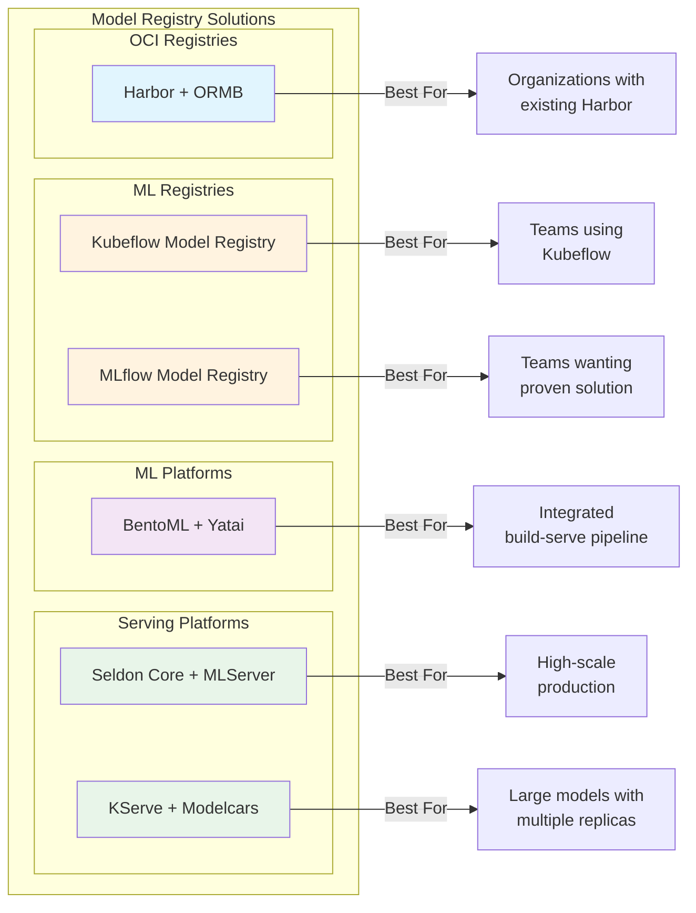
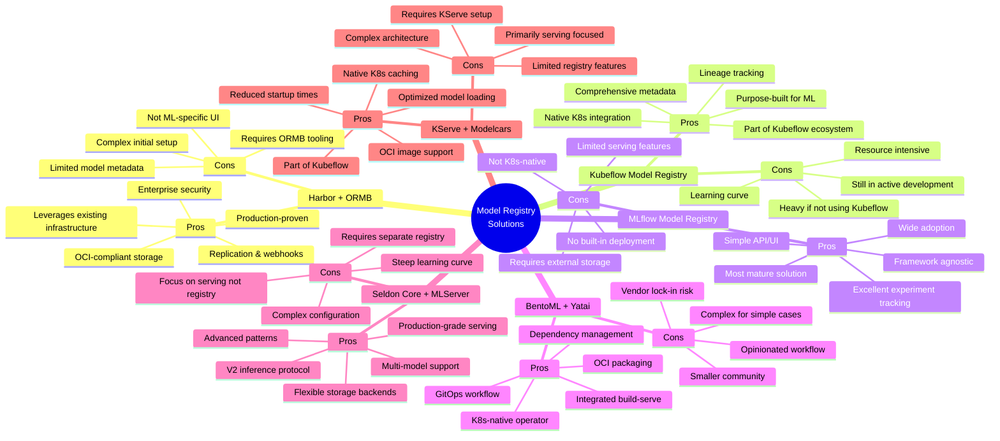
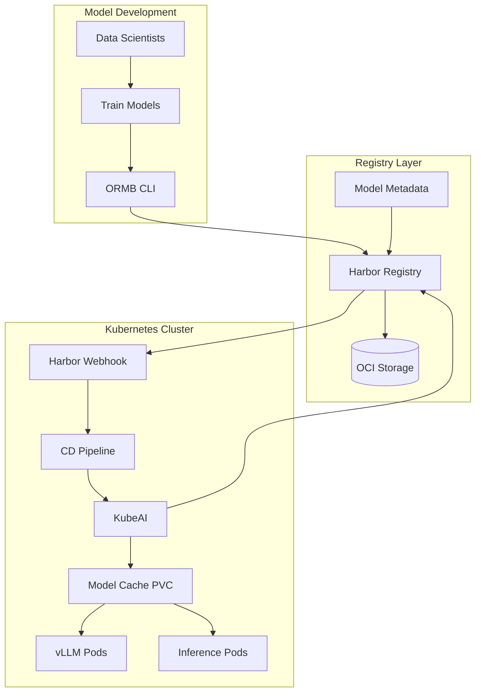
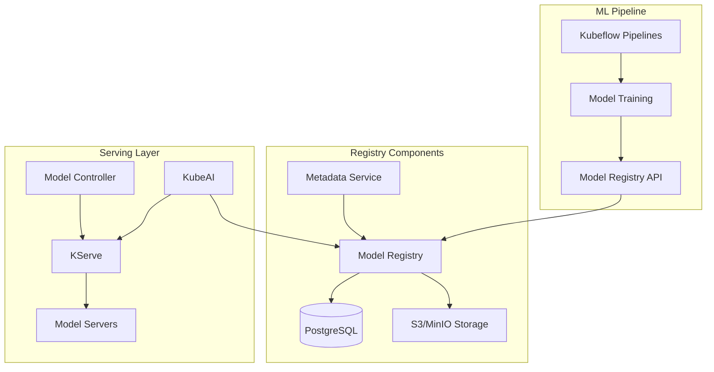
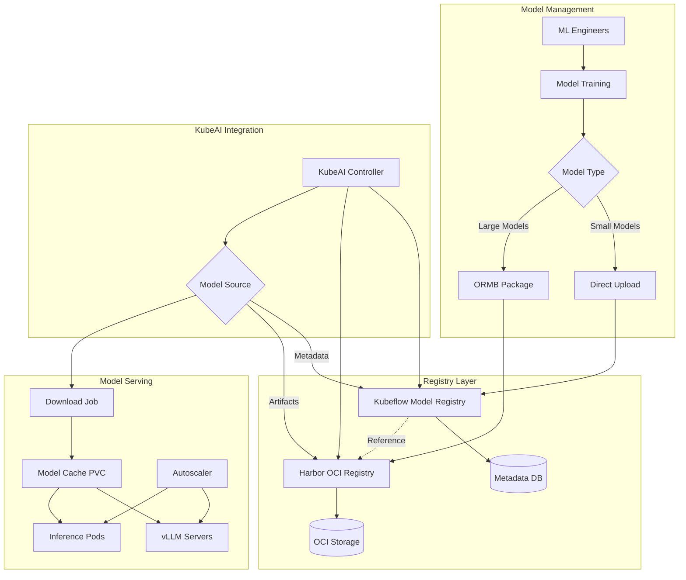

# Model Registry Solutions for Kubernetes: A Comprehensive Comparison

## Executive Summary

This document provides a comprehensive comparison of model registry solutions suitable for Kubernetes environments, specifically focused on integrating with KubeAI for internal model management and serving.

## Comparison Overview

## Detailed Comparison

## Solution Architecture Overview

### 1. Harbor + ORMB Architecture

**Key Components:**
- **ORMB**: CLI tool for packaging ML models as OCI artifacts
- **Harbor**: Enterprise OCI registry with security features
- **KubeAI**: Orchestrates model deployment and serving
- **Model Cache**: Persistent storage for downloaded models

### 2. Kubeflow Model Registry Architecture

**Key Components:**
- **Model Registry**: Central catalog for model versions
- **Metadata Service**: Tracks lineage and experiments
- **KServe Integration**: Native model serving
- **Storage Backend**: Flexible storage options

### 3. Hybrid Architecture (Recommended)

## Implementation Recommendations

### For KubeAI Internal Model Registry

Based on the analysis, here are the recommended approaches:

#### Option 1: Harbor-Based Solution (Recommended)
**Why:** 
- Leverages existing container infrastructure
- OCI standardization ensures long-term compatibility
- Enterprise-grade security and access control
- Proven in production environments

**Implementation Steps:**
1. Deploy Harbor with ML-specific project structure
2. Install ORMB CLI for model packaging
3. Configure KubeAI to pull from Harbor
4. Set up webhooks for automated deployment

#### Option 2: Hybrid Approach
**Why:**
- Best of both worlds - ML-specific features + OCI storage
- Metadata management through Kubeflow
- Artifact storage in Harbor
- Flexibility for different model types

**Implementation Steps:**
1. Deploy Kubeflow Model Registry for metadata
2. Use Harbor for actual model storage
3. Configure KubeAI to query metadata and pull artifacts
4. Implement sync mechanism between systems

### Key Considerations

1. **Storage Requirements**
   - Large language models require significant storage
   - Consider using S3-compatible storage for cost efficiency
   - Implement retention policies for old versions

2. **Security**
   - Model artifacts may contain sensitive data
   - Implement RBAC at registry level
   - Enable vulnerability scanning for base images

3. **Performance**
   - Use local caching to reduce download times
   - Implement lazy loading for large models
   - Consider edge caching for distributed clusters

4. **Integration Points**
   - CI/CD pipeline integration
   - Monitoring and alerting
   - Model versioning strategy
   - Rollback mechanisms

## Conclusion

For KubeAI's use case of providing a consistent registry for pulling models within Kubernetes:

1. **Short-term**: Implement Harbor + ORMB for immediate OCI-based model storage
2. **Long-term**: Consider hybrid approach with Kubeflow Model Registry for advanced ML lifecycle management
3. **Key Success Factors**:
   - Standardize on OCI format for future compatibility
   - Implement proper versioning and tagging strategies
   - Ensure security and access control
   - Plan for scalability from the start

This approach provides a production-ready solution that can grow with your ML infrastructure needs while maintaining compatibility with the broader Kubernetes ecosystem.