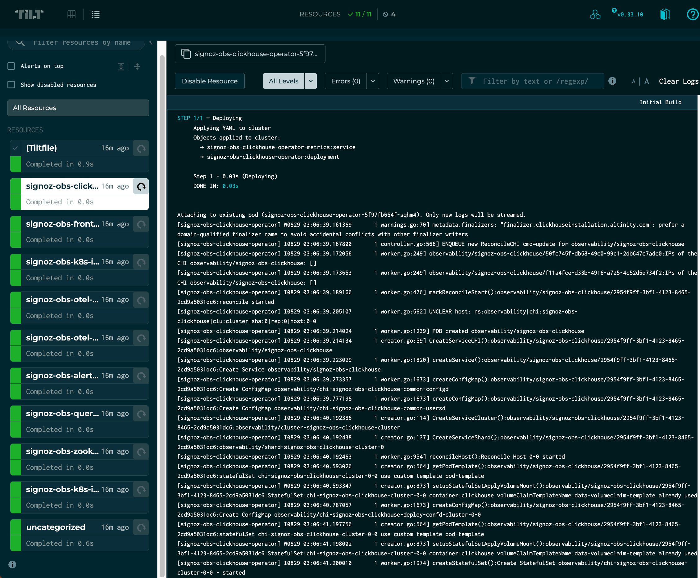

# CNCFLAB

This is repo is created at education purpose. It contains the running example for tools mentioned in [cncf landscape](https://landscape.cncf.io/guide#orchestration-management--api-gateway). 

## Getting started

### Prerequisite
These software need to be installed and well setup in local machine
- [Nix shell](https://nixos.org/download/#download-nix)
- [Direnv](https://direnv.net/)
- Container run time. eg: Docker desktop ^4.30.0

### 1. Install software

Navigate to the repo folder, all software will be automatically installed by direnv and nix setup

```
~/p/dzungtr> cd cncflab/
direnv: loading ~/project/dzungtr/cncflab/.envrc
direnv: using nix
direnv: export <SOME env var>
```

List of softwares installed can be tracked in `default.nix` file. The lab uses `kind` as k8s cluster distribution to set up local easily. More information, you can reference here https://kind.sigs.k8s.io/

### 2. Create cluster and run software

```shell
# To start the cluster with the set up you want:
tilt up -- <options>

# eg:

# default
tilt up
tilt up -- --cluser default # optional

# signoz as observability
tilt up -- --observability signoz

# Cilium run as primary network configuration
tilt up -- --cluster cni-disable --network cilium
```



Alternatively, you can create cluster by running
```shell
kind create cluster k8s-distribution/kind/<config-file>
```

## Project structure

#### 1. Use cases

This folder contains deployment's manifests for different example applications.
Some example include:
1. REST API micro service
2. Hotrod: https://github.com/jaegertracing/jaeger/tree/main/examples/hotrod
4. Starswar: https://docs.cilium.io/en/stable/gettingstarted/demo/
5. Guestbooks: https://github.com/argoproj/argocd-example-apps


#### 2. Domain folder (APIGateway, ServiceMesh, ...)

These folder present for each domain mentioned in CNCF landscape. In each of domain contains the example usage of the software. 
To run a the stack, you can either run command:

```shell
kustomize build <kustomzation-path> --enable-helm | kubectl apply -f -

# or provide the flag in tilt up command
tilt up -- --<folder-name> <tool-name>

# ex:
tilt up -- --observability signoz
```

#### 3. Scripts

Predefined utitlity scripts