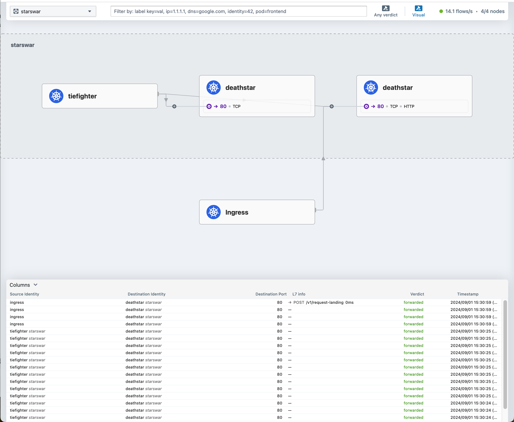

# Cilium network


Cilium is a software powered by eBPF technology. A Cluster can use cilium as CNI controller and primary network management stack to replace:
- Service mesh
- API Gateway 
- Ingress/Gateway Controller
- Kube proxy
- Load balancer

The manifest in this folder contains the example of using cilium for the above purpose (except kube proxy replacment). You can refer to the configuration avaiable in charts/values.yml to explore more configuation.


## Getting started

#### 1. Create cluster and run cilium

```shell
tilt up -- --cluster cni-disable --network cilium
```

> If the stack fail to start the Cilium installation, you can stop the command and rerun again.

Verify installation by running:

```shell
kubectl config use-context kind-cni-disable
kubectl get pods -n kube-system

NAME                                                        READY   STATUS              RESTARTS   AGE
cilium-5fcnd                                                1/1     Running             0          2m30s
cilium-8ntl4                                                0/1     Init:0/6            0          2m30s
cilium-dcrd8                                                1/1     Running             0          2m30s
cilium-envoy-ctpt8                                          1/1     Running             0          2m30s
cilium-envoy-grv9m                                          0/1     ContainerCreating   0          2m30s
cilium-envoy-jvzkp                                          0/1     ContainerCreating   0          2m30s
cilium-envoy-z9c9g                                          1/1     Running             0          2m30s
cilium-operator-6496497db9-9fqpv                            1/1     Running             0          2m30s
cilium-operator-6496497db9-h4mhn                            1/1     Running             0          2m30s
cilium-operator-6496497db9-vwzw2                            1/1     Running             0          2m30s
cilium-zkx5g                                                1/1     Running             0          2m30s
coredns-76f75df574-dqnk6                                    1/1     Running             0          2m58s
coredns-76f75df574-zqksh                                    1/1     Running             0          2m58s
etcd-cncflab-cni-disable-control-plane                      1/1     Running             0          3m13s
hubble-relay-9c74c99fb-p4nmk                                0/1     Running             0          2m30s
hubble-ui-7cd5cbb8b7-74t5j                                  0/2     ContainerCreating   0          2m30s
kube-apiserver-cncflab-cni-disable-control-plane            1/1     Running             0          3m12s
kube-controller-manager-cncflab-cni-disable-control-plane   1/1     Running             0          3m12s
kube-proxy-dqhmq                                            1/1     Running             0          2m54s
kube-proxy-mj99c                                            1/1     Running             0          2m52s
kube-proxy-rcnbf                                            1/1     Running             0          2m58s
kube-proxy-v7ckg                                            1/1     Running             0          2m53s
kube-scheduler-cncflab-cni-disable-control-plane            1/1     Running             0          3m12s
```

#### 2. Testing and tunning around

To start the Cilium's starswar example:
```shell
kustomize build usecases/starswar | kubectl apply -f -
```

To open Hubble service map UI:
```shell
cilium hubble ui
```



Try different Cilium features by modifying `values.yml`

```shell
# Expose metrics to scraped by Signoz
operator:
  replicas: 3
  # Observability with signoz
  podAnnotations:
    signoz.io/scrape: 'true'
    signoz.io/port: '9963'
    signoz.io/path: /metrics
```